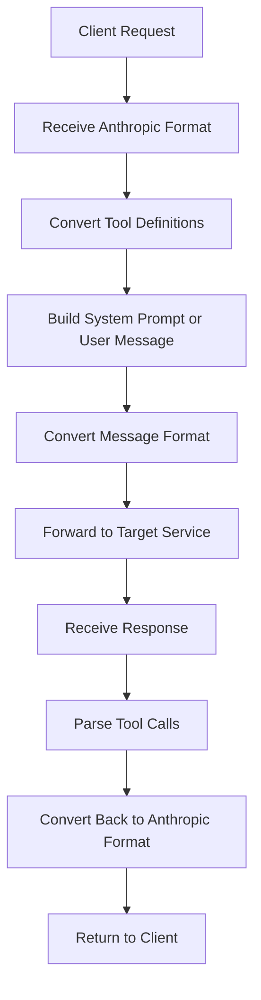

# Claude Code Adapter FastAPI

[中文](/docs/index.md) | English

Welcome to Claude Code Adapter FastAPI! This is a lightweight proxy/adapter layer based on FastAPI that converts Anthropic/Claude messages and tool call requests to OpenAI Chat Completions compatible format; appends tool definitions as user inputs (instead of modifying system prompts) to avoid system prompt cache invalidation; supports optional automatic tool selection, SSE streaming forwarding, and response conversion back to Anthropic format. It provides server-side proxying without modifying client SDKs.

## 🎯 Project Overview

Key features include:

- **Tool Prompt Appending (User)**: Appends tool definitions as user inputs to avoid system prompt cache invalidation
- **Format Adaptation**: Bidirectional conversion between Anthropic and OpenAI message and tool call formats
- **Automatic Tool Selection (Optional)**: Intelligently selects tools from the tool list based on recent conversation context
- **Proxy Forwarding**: Supports both non-streaming and SSE streaming forwarding to target services

## 🚀 Quick Start

### One-Click Setup

```bash
# Clone the repository
git clone https://github.com/wangfumin1/claude-code-adapter-fastapi.git
cd claude-code-adapter-fastapi

# Use platform-specific scripts
# Windows:
scripts\setup.bat
# Linux/macOS:
./scripts/setup.sh
```

### Start the Service

```bash
# Using Makefile
make run

# Or run directly
python -m uvicorn src.claude_code_adapter.app:app --host 0.0.0.0 --port 8000
```

### Verify Installation

Visit http://localhost:8000/docs to view the API documentation.

## 📖 Detailed Documentation

- [🚀 Quick Start Guide](getting-started.md) - Complete installation and configuration guide
- [⚙️ Configuration Guide](configuration.md) - Detailed configuration options
- [📚 API Documentation](api.md) - Complete API reference
- [🛠️ Development Guide](development.md) - Development and contribution guide

> 💡 **Tip**: We recommend reading the documentation in order, starting with the Quick Start Guide.

## 🔧 How It Works



## 💡 Use Cases

- **Model Compatibility**: Enable tool usage for models that do not support native tool calls
- **Format Unification**: Standardize tool call formats across different model APIs
- **System Integration**: Integrate tool call functionality into existing systems
- **Development Debugging**: Test tool call functionality during development

## 🛠️ Technology Stack

- **FastAPI**: Modern, fast web framework
- **Pydantic**: Data validation and settings management
- **OpenAI Python**: OpenAI API client
- **Uvicorn**: ASGI server
- **Docker**: Containerized deployment
