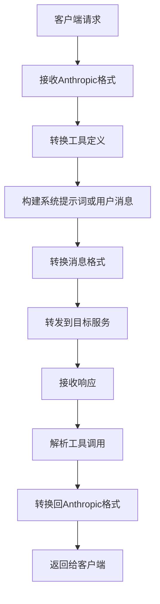

# Claude Code Adapter FastAPI

中文 | [English](/docs/en/index.md)

一个基于 FastAPI 的轻量代理/适配层：将 Anthropic/Claude 的消息与工具调用请求转换为 OpenAI Chat Completions 兼容格式；智能选择工具定义处理策略（系统提示词 vs 用户消息），根据配置自动优化性能和功能完整性；支持可选的自动工具选择、SSE 流式转发，以及将目标模型响应回转为 Anthropic 格式。仅提供服务端代理，不侵入客户端 SDK。

## 🎯 项目概述

主要功能包括：

- 🔧 **智能工具定义处理**: 根据配置自动选择工具定义位置（系统提示词 vs 用户消息），优化性能和功能完整性
- 🔄 **格式适配**: Anthropic ⇄ OpenAI 消息与工具调用格式双向转换
- 🖼️ **多模态内容支持**: 根据结构内容模型映射，自动转换多模态消息内容，以支持多模态模型
- 🧠 **自动工具选择（可选）**: 基于近期对话上下文从工具列表中智能挑选
- 📡 **代理转发**: 支持非流式与 SSE 流式转发到目标服务
- ⚙️ **灵活配置**: YAML 配置与环境变量覆盖，热重载生效
- 🐳 **Docker 部署**: 一条命令即可启动

## 🚀 快速开始

### 一键设置

```bash
# 克隆项目
git clone https://github.com/wangfumin1/claude-code-adapter-fastapi.git
cd claude-code-adapter-fastapi

# 使用平台特定脚本
# Windows:
scripts\setup.bat
# Linux/macOS:
./scripts/setup.sh
```

### 启动服务

```bash
# 使用Makefile
make run

# 或直接运行
python -m uvicorn src.claude_code_adapter.app:app --host 0.0.0.0 --port 8000
```

### 验证安装

访问 http://localhost:8000/docs 查看API文档

## 📖 详细文档

- [🚀 快速开始指南](getting-started.md) - 完整的安装和配置指南
- [⚙️ 配置说明](configuration.md) - 详细的配置选项说明
- [📚 API文档](api.md) - 完整的API参考文档
- [🛠️ 开发指南](development.md) - 开发和贡献指南

> 💡 **提示**: 建议按顺序阅读文档，从快速开始指南开始。

## 🔧 工作原理



## 💡 使用场景

- **模型兼容性**: 让不支持原生工具调用的模型使用工具
- **格式统一**: 统一不同模型API的工具调用格式
- **系统集成**: 在现有系统中集成工具调用功能
- **开发调试**: 在开发过程中测试工具调用功能

## 🛠️ 技术栈

- **FastAPI**: 现代、快速的Web框架
- **Pydantic**: 数据验证和设置管理
- **OpenAI Python**: OpenAI API客户端
- **Uvicorn**: ASGI服务器
- **Docker**: 容器化部署
